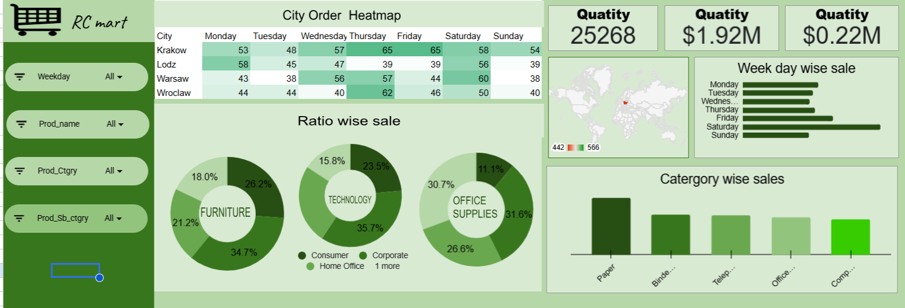

#  RC Mart — Sales Analytics Dashboard

<p align="center">
  
</p>

---

##  Project Overview

This project presents an **interactive sales analytics dashboard** for **RC Mart**, built using **Excel / Power BI** on retail transaction data covering **January – June 2015**. The dataset contains **1,952 records** across **4 Polish cities**, **3 product categories**, and **4 customer segments**, with full weekday-level order tracking.

---

## Dataset Description

**File:** `rvsalesdata.xlsx`

| Column | Description |
|---|---|
| `Order Date` | Date of the transaction (Jan–Jun 2015) |
| `Order ID` | Unique identifier for each order |
| `Customer ID` | Unique customer identifier |
| `Customer Name` | Name of the customer |
| `Customer Segment` | Segment: Consumer, Corporate, Home Office, Small Business |
| `City` | City of order: Krakow, Lodz, Warsaw, Wroclaw |
| `Product Category` | High-level category: Furniture, Technology, Office Supplies |
| `Product Sub-Category` | Sub-category (e.g., Paper, Binders, Telephones, Chairs) |
| `Product Name` | Name of the product sold |
| `Unit Price` | Price per unit ($) |
| `Quantity ordered new` | Quantity of items ordered |
| `Sales` | Total sales revenue ($) |
| `Profit` | Net profit ($) |
| `Order Weekday` | Day of week the order was placed |
| `Weekday helper` | Numeric weekday index for sorting |
| `Order returned` | Whether the order was returned |

---

## Questions Solved / Business Problems Addressed

###  KPI & Summary Metrics
1. **What is the total quantity of items ordered across all cities and products?**
   >  *Total Quantity = 25,268 units*

2. **What is the total sales revenue generated?**
   >  *Total Sales = $1.92M*

3. **What is the total profit earned?**
   >  *Total Profit = $0.22M*

---

### City & Geographic Analysis
4. **How are orders distributed across cities by day of the week?**
   > Visualized as a **City Order Heatmap** — rows = Krakow, Lodz, Warsaw, Wroclaw; columns = Monday through Sunday; color intensity shows order volume

5. **Which city–weekday combination has the highest order volume?**
   > Discoverable from the heatmap — e.g., Krakow on Thursday/Friday peaks at 65 orders

6. **What is the global geographic distribution of sales?**
   > Shown on a **World Map** with location markers for sales concentration

---

###  Customer Segment Analysis
7. **How is sales revenue distributed across customer segments for each product category?**
   > Visualized as **Ratio Wise Sale** — three donut charts (Furniture, Technology, Office Supplies), each broken into Consumer, Corporate, Home Office, and Small Business segments

8. **Which customer segment contributes the most to Furniture sales?**
   >  *Corporate leads at 34.7%, followed by Small Business at 26.2%*

9. **Which customer segment contributes the most to Technology sales?**
   >  *Corporate leads at 35.7%, followed by Home Office at 23.5%*

10. **Which customer segment contributes the most to Office Supplies sales?**
    > *Small Business leads at 31.6%, followed by Home Office at 30.7%*

---

###  Weekday & Time Analysis
11. **On which days of the week are sales highest?**
    > Visualized via **Weekday Wise Sale** horizontal bar chart — comparing Monday through Sunday sales volumes

12. **Are weekends (Saturday/Sunday) stronger or weaker sales days compared to weekdays?**
    > Directly comparable from the weekday bar chart

---

### Product & Category Analysis
13. **Which product sub-categories drive the most sales revenue?**
    > Visualized via **Category Wise Sales** bar chart — top sub-categories include Paper, Binders, Telephones, Office Machines, and Computers

14. **How do the three product categories (Furniture, Technology, Office Supplies) compare in terms of segment-wise revenue share?**
    > Answered through the three donut charts in the Ratio Wise Sale section

---

###  Interactive Filtering
15. **How does performance change when filtered by a specific Weekday?**
    > Interactive **Weekday filter** updates all visuals dynamically

16. **How does performance change when filtered by a specific Product Name?**
    > Interactive **Prod_name filter** for product-level drill-down

17. **How does performance change when filtered by Product Category?**
    > Interactive **Prod_Ctgry filter** updates charts for category-level analysis

18. **How does performance change when filtered by Product Sub-Category?**
    > Interactive **Prod_Sb_ctgry filter** for granular sub-category exploration

---

##  Dashboard Visuals

| Visual | Type | Insight |
|---|---|---|
| Total Quantity / Sales / Profit | KPI Cards | High-level performance summary |
| City Order Heatmap | Matrix / Heatmap | Orders by city × weekday |
| Ratio Wise Sale | Donut Charts (×3) | Segment share per product category |
| Weekday Wise Sale | Horizontal Bar Chart | Sales volume by day of week |
| Category Wise Sales | Bar Chart | Revenue by product sub-category |
| World Map | Geographic Map | Global sales distribution |

---

##  Tools Used

- **Microsoft Excel / Power BI** — Dashboard creation & visualization
- **Data Range:** January 2015 – June 2015 (1,952 transactions)
- **Cities:** 4 (Krakow, Lodz, Warsaw, Wroclaw)
- **Product Categories:** 3 (Furniture, Technology, Office Supplies)
- **Customer Segments:** 4 (Consumer, Corporate, Home Office, Small Business)

---

##  How to Use

1. **Clone this repository**
   ```bash
   git clone https://github.com/your-username/rc-mart-sales-dashboard.git
   cd rc-mart-sales-dashboard
   ```

2. **Open the Excel file**
   ```
   Open rvsalesdata.xlsx in Microsoft Excel or import into Power BI Desktop
   ```

3. **Explore the Dashboard**
   - Use the **Weekday** filter to analyze a specific day
   - Use the **Prod_name / Prod_Ctgry / Prod_Sb_ctgry** filters to drill into products
   - Hover over the heatmap cells to see exact city × weekday order counts
   - All charts update dynamically based on your selection

---

##  Repository Structure

```
rc-mart-sales-dashboard/
│
├── README.md               # Project documentation (this file)
├── rvsalesdata.xlsx        # Raw dataset + Dashboard
└── rv.png                  # Dashboard screenshot
```

---

## Key Insights

-  **25,268 units** sold generating **$1.92M** in revenue with **$0.22M** profit
-  **Krakow** shows the highest single-day order spike (65 on Thursday & Friday)
-  **Corporate segment** dominates both Furniture (34.7%) and Technology (35.7%) sales
-  **Saturday** appears to be a strong sales day based on the weekday chart
-  **Paper** and **Binders** are the top-performing Office Supplies sub-categories
-  Sales are geographically concentrated in **Poland**

---

##  Contributing

Feel free to fork this project, raise issues, or submit pull requests for improvements!

---

